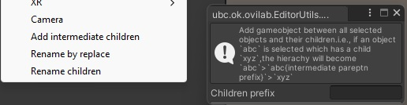
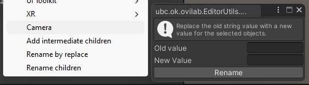
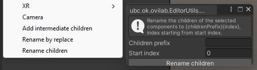
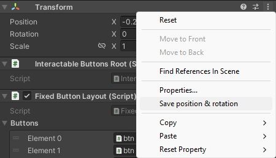

# Edito Utils
Collections of editor utilities for Unity:

## Installation
Install as a git dependency (https://docs.unity3d.com/Manual/upm-ui-giturl.html)

or

Add it as a embedded package - Clone/copy/submodule this repo into the `Packages` directory of your unity project.

## Usage
### AddIntermediateParent

Add gameobject between all selected objects and their children. i.e., if an object `abc` is selected which has a child `xyz`, the hierachy will become `abc`>`abc{intermediate parept prefix}`>`xyz`

Available in `GameObject` menu or right-click in `Hierarchy`

### RenameByReplace

In the name of the selected items replace the old string value with a new value.

Available in `GameObject` menu or right-click in `Hierarchy`

### RenameChildren

Rename the children of the selected components to {childrenPrefix}{index}, index starting from start index.

Available in `GameObject` menu or right-click in `Hierarchy`

### SaveValuesOfComponent

While in play mode, save any changes to rotation and position of a transform when exiting play mode.

Select the context menue (right click on transform, or click on the three dots on the transform) and select `Save position & rotation`. The value of the position and rotation as seen on the transform when it was clicked will be set when exiting play mode.
